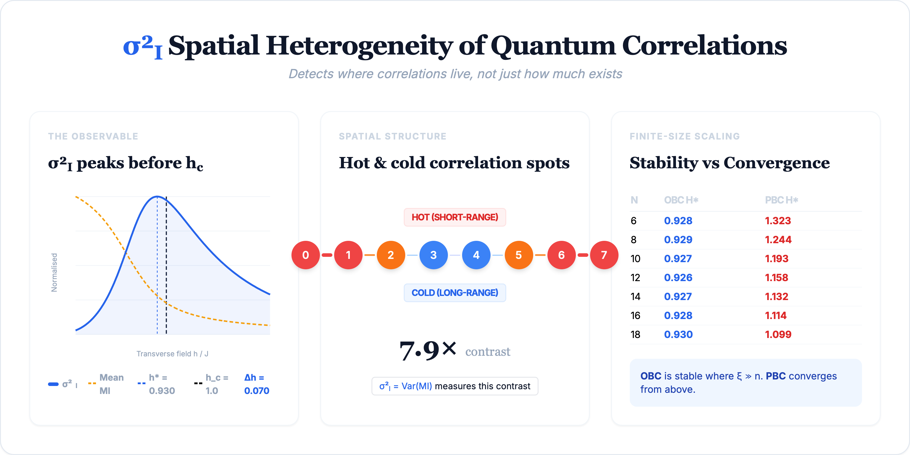

# σ²_I: Structural Observable for Finite Quantum Systems

Reproducible Python implementation of **σ²_I**, a basis-invariant, partition-free structural observable for finite quantum systems.

**σ²_I = Var(I(Aᵢ:Aⱼ))**

The variance of pairwise mutual information over all subsystem pairs. The observable detects **where correlations live**, not merely **how much** correlation exists.



This repository accompanies:

> R. J. Ede, "σ²_I: A Second-Moment Functional of Pairwise Correlations as a Structural Observable in Finite Quantum Systems" (2026 manuscript).

---

## What this repository contains

This repo provides three main paths for computing **σ²_I** in the transverse-field Ising model (TFIM):

- A **small-system exact diagonalisation** reference implementation
- A **Jordan–Wigner + Pfaffian** implementation for validation and moderate sizes
- A **Jordan–Wigner determinant-based** implementation for larger scans

The intent is to provide:

- A clear reference path
- Overlapping methods for cross-checking
- A scalable route for finite-size studies

Also see:
- [Methods overview](METHODS.md)
- [Disclaimer](DISCLAIMER.md)
- [License terms](LICENSE)
- [Security policy](SECURITY.md)
- [Contribution guidelines](CONTRIBUTING.md)

---

## Repository map

### `sigma2i_core.py` — Reference implementation (exact diagonalisation)

Core routines for:

- Exact diagonalisation of the TFIM
- Pairwise mutual information computation
- σ²_I evaluation from state vectors, density matrices, or precomputed two-site reduced density matrices

Best for:

- Small systems (n ≤ 18 on standard hardware)
- Ground-truth reference calculations
- Learning the API
- Running the built-in demo

### `tfim_jw_pfaffian_sigma2i_obc.py` — Pfaffian validation path

Jordan–Wigner free-fermion implementation using Pfaffian reconstruction of spin correlators via Majorana correlation matrices.

Best for:

- Moderate system sizes
- Cross-checking the determinant path
- Validating the spin-correlator reconstruction pipeline

This was the first implementation used to reveal the finite-size regime structure of σ²_I.

### `tfim_jw_determinant_sigma2i_obc.py` — Scalable scan path

Fast Jordan–Wigner / Bogoliubov free-fermion implementation using the tridiagonal eigenproblem and determinant-based correlator reconstruction.

Includes:
- command-line scan configuration
- local-maximum reporting
- quadratic peak refinement

Best for:
- Larger TFIM scans
- Finite-size scaling studies
- Peak tracking across system sizes

### `examples/` — Runnable examples

Small example scripts for local execution and quick inspection of outputs.

Best for:
- First-time users
- Checking how to run the public code
- Simple reproducibility demonstrations

### `tests/` — Basic validation checks

Minimal tests for core functionality and numerical sanity checks.

Best for:
- Confirming the public code runs correctly
- Checking basic invariants and simple reference cases
- Lightweight regression testing

### `figures/` — Example outputs and reference visuals

Saved plots and example output figures associated with the repository.

Best for:
- Inspecting representative outputs
- Comparing runs visually
- Supporting documentation and presentation

---

## Validation and scope

The three paths serve different roles:

- **ED (core):** Ground-truth reference implementation for small systems and arbitrary Hamiltonians.
- **Pfaffian path:** Main validation and cross-check path. Validated against exact diagonalisation at n = 4, 6, 8, 10. Explicitly validated to n ≤ 65, with exploratory use into the low-70s.
- **Determinant path:** Large-n scan path. Cross-checked against the Pfaffian/JW path in the overlap regime and used for extended scaling and crossover analysis.

| Method      | Role                          | Range / status                                      |
|-------------|-------------------------------|-----------------------------------------------------|
| ED (core)   | Ground truth, any Hamiltonian | Practical for small n (n ≤ 18)                      |
| Pfaffian    | Validation / overlap check    | Validated to n ≤ 65; exploratory into low-70s       |
| Determinant | Large-n scan path             | Used for extended scaling and crossover analysis    |

---

## Requirements

- Python 3.9+
- NumPy
- SciPy
- Matplotlib (optional, for plots)

Install dependencies with:

```bash
pip install numpy scipy matplotlib
```

---

## Quick start

### 1. Run the built-in demo

The easiest way to confirm the code is working:

```bash
python3 sigma2i_core.py
```

By default this will:

* Run the built-in TFIM demo
* Use n = 8
* Use open boundary conditions
* Scan h/J from 0.3 to 1.8
* Use 501 scan points
* Save a plot as `sigma2i_core.png`

You can also customise the run from the command line:

```bash
python3 sigma2i_core.py --n 8 --bc open --h-min 0.3 --h-max 1.8 --points 501 --plot
```

Example: periodic boundary conditions

```bash
python3 sigma2i_core.py --n 8 --bc periodic --h-min 0.9 --h-max 1.4 --points 501 --no-plot
```

### 2. Run a Pfaffian scan

For moderate-size validation and overlap checks.

Default run:

```bash
python3 tfim_jw_pfaffian_sigma2i_obc.py
```
Default settings:

* n = 8, 20, 40, 50, 60
* h-min = 0.940
* h-max = 1.000
* coarse-step = 31
* fine-width = 0.010
* fine-step = 61

Custom sizes:
```bash
python3 tfim_jw_pfaffian_sigma2i_obc.py -n 8 20 40 50 60
```

Custom scan window:
```bash
python3 tfim_jw_pfaffian_sigma2i_obc.py -n 50 --coarse-min 0.94 --coarse-max 1.00
--coarse-steps 31 --fine-half-width 0.01 --fine-steps 61
```

### 3. Run a determinant scan

Without any flags, the script runs with its default settings:

```bash
python3 tfim_jw_determinant_sigma2i_obc.py
```

Default settings:

* n = 50
* h-min = 0.90
* h-max = 1.05
* h-step = 0.001
* log-base = 2

Example scan
```bash
python3 tfim_jw_determinant_sigma2i_obc.py -n 50 --h-min 0.90 --h-max 1.05 --h-step 0.001
```

---

## Interactive demo

To inspect the result in Python directly:

```python
from sigma2i_core import demo_tfim

scan = demo_tfim(n=8)
peak = scan.results[scan.peak_idx]

print("h* =", scan.peak_param)
print("sigma2 =", peak.sigma2)
print("mean_mi =", peak.mean_mi)
print("contrast_ratio =", peak.contrast_ratio)
print("hot_pairs =", peak.hot_pairs[:3])
print("cold_pairs =", peak.cold_pairs[:3])
```

Note: `demo_tfim(...)` returns a scan result. The peak-state result is stored in `scan.results[scan.peak_idx]`.

---

## Advanced usage

These functions are for users who already have quantum-state data from another script, simulator, or experiment. If you are unsure what `psi`, `rho`, or `rdms` are, use the built-in demo instead.

### From a state vector

```python
from sigma2i_core import from_state_vector

res = from_state_vector(psi, n_qubits=8)
print(res.sigma2, res.mean_mi, res.contrast_ratio)
```

### From a density matrix

```python
from sigma2i_core import from_density_matrix

res = from_density_matrix(rho, n_qubits=8)
print(res.sigma2, res.mean_mi, res.contrast_ratio)
```

### From precomputed two-site reduced density matrices

```python
from sigma2i_core import from_rdms

# rdms[(i, j)] = 4x4 density matrix for qubits i < j
res = from_rdms(rdms, n_qubits=8)
print(res.sigma2, res.mean_mi, res.contrast_ratio)
```

---

## Output objects

### `Sigma2IResult`

Returned by `from_state_vector(...)`, `from_density_matrix(...)`, and `from_rdms(...)`.

Contains: `sigma2`, `mean_mi`, `mis`, `pairs`, `hot_pairs`, `cold_pairs`, `contrast_ratio`.

### `ScanResult`

Returned by `demo_tfim(...)` and `scan(...)`.

Contains: `params`, `sigma2`, `mean_mi`, `peak_param`, `peak_idx`, `results`.

To extract the peak-state result from a scan:

```python
peak = scan.results[scan.peak_idx]
```

---

## Recommended workflow

1. Run `python3 sigma2i_core.py`
2. Inspect the interactive demo if needed
3. Use `sigma2i_core.py` as the reference path for small systems
4. Use the Pfaffian script for overlap checks and moderate sizes
5. Use the determinant script for larger scans and scaling studies

---

## Reproduce a representative result

For the TFIM with open boundary conditions, the σ²_I peak lies below the critical point h_c = 1.0.

To reproduce a representative result near the peak:

- Use the determinant script
- Set n = 14
- Choose an h_range covering approximately [0.85, 1.05]

---

## Limitations

- Exact diagonalisation is only practical for small systems
- The large-system paths are model-specific (TFIM with OBC)
- `from_state_vector(...)` requires a valid state vector of length 2^n
- `demo_tfim(...)` returns a scan object, not a single-state result
- Plotting requires matplotlib
- Exploratory ranges should not be read as fully validated ranges

---

## Citation

```bibtex
@article{Ede2026sigma2i,
  author  = {Ede, Ryan J.},
  title   = {$\sigma^2_I$: A Second-Moment Functional of Pairwise
             Correlations as a Structural Observable in Finite
             Quantum Systems},
  year    = {2026},
  note    = {Manuscript}
}
```

---

## License

This repository is **not open source**. See [LICENSE](LICENSE) for the terms governing inspection, local execution, and other permitted uses.
